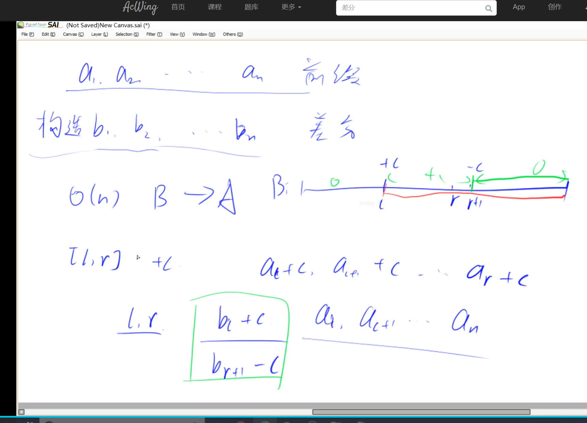

高精度
存取较大的数字时，一般从高位开始存储，因为便于进位如987654321分别存入012345678的位置
高精度加法

vector<int>  add(vector<int>&A,vector<int> &B)
{
vector<int>C;

for (int i = 0;i< A.size() || i<B.size();i++)
{
int t =0;//进位
for(inti=0;i<A.size()|li<B.size();i ++ )
if(i< A.size())t += A[i];
if(i<B.size())t += B[i];c.push back(t % 10);
t /= 10;

}

if(t)c.push_back(1);
return c;
}

string a, b;
vector<int>A，B;
cin>>a>>b;//a="123456"
for(inti=a.size()-1;i>=0;i-)A.push back(a[i]-'0');//A=[6,5,4,3,2,1]		如果要添加的数字类型就要-‘0’，利用ASCII码值相减 
for(inti=b.size()-1;i>=0;i--)B.push back(b[i]-‘0’）

auto C=add(A,B);

for (int i = C.size()-1; i >=0;i--)printf("%d",C[i]);


高精度减法

减法和加法差距不大，只需要特别注意t的大小

#include<iostream>
#include<vector>

using namespace std;

const int N=1e6+10;

bool cmp(vector<int> &A,vector<int> &B)		//判断正负，如a<b,则是负数只需计算-（b-a）即可
{
    if (A.size() != B.size()) return A.size()>B.size();
    for (int i=A.size()-1;i>=0;i--)
        if (A[i] != B[i])
            return A[i]>B[i];
    return true;
}

vector<int> mes(vector<int> &A,vector<int> &B)
{
    vector<int> C;
    for (int i=0,t=0;i<A.size();i++)
    {
        t=A[i]-t;		//t为是否有借位
        if (i<B.size()) t -= B[i];
        C.push_back((t+10)%10);
        if (t<0) t=1;
        else t=0;
    }
    

    while (C.size() > 1 && C.back()==0) C.pop_back();		//去除前导0
    
    return C;
}

int main()
{
    string a,b;
    cin>>a>>b;
    

    vector<int> A,B; 
    
    for (int i=a.size()-1;i>=0;i--) A.push_back(a[i]-'0');
    for (int i=b.size()-1;i>=0;i--) B.push_back(b[i]-'0');
    
    if (cmp(A,B))
    {
        auto C=mes(A,B);
        for (int i=C.size()-1;i>=0;i--) cout<<C[i];
    }
    else
    {
        auto C=mes(B,A);
        cout<<'-';
        for (int i=C.size()-1;i>=0;i--) cout<<C[i];
    }
    
    return 0;
}


高精度乘法

需要注意进位的大小

#include<bits/stdc++.h>
#include<vector>

using namespace std;

vector<int> mul(vector<int> &A,int b)
{
    vector<int> C;
    

    int t=0;
    for (int i=0;i<A.size() || t;i++)
    {
        if (i<A.size()) t += A[i]*b;	
        C.push_back(t%10);
        t/=10;			//判断进位多少
    }
    while(C.size()>1&&C.back()==0)C.pop_back();
    return C;
}

int main()
{
    string a;
    int b;
    cin>>a>>b;
    
    vector<int> A;
    for (int i=a.size()-1;i>=0;i--) A.push_back(a[i]-'0');
    
    auto C=mul(A,b);
    for (int i=C.size()-1;i>=0;i--) printf("%d",C[i]);
    
    return 0;
}


高精度除法

高精度除法相比前几个较为麻烦，被除数一般是从前到后排列，但是为了和其他的高精度算法相互统一，就从后向前排列，所以最后还需要reverse，后去除前导0

#include<bits/stdc++.h>

using namespace std;

vector<int> div(vector<int> &A, int b, int &r)
{
    vector<int> C;
    r = 0;
    for (int i = A.size() - 1; i >= 0; i -- )
    {
        r = r * 10 + A[i];			//余数*10+位数
        C.push_back(r / b);		//商
        r %= b;					//余数
    }
    reverse(C.begin(), C.end());		//前后位置调换，在algorithm头文件内部
    while (C.size() > 1 && C.back() == 0) C.pop_back();	//去除前导0
    return C;
}
int main(){
    vector<int>A;
    string a;
    int b;
    cin>>a>>b;
    

    for(int i=a.size()-1;i>=0;i--)  A.push_back(a[i]-'0');
    
    int r=0;
    auto C=div(A,b,r);
    for(int i=C.size()-1;i>=0;i--)   cout<<C[i];
    cout<<endl<<r<<endl;
}


前缀和：

有a\~1+a\~2+...a\~n

有s\~i=a\~1+....+a\~i		s\~i=s\~i-1+a\~i	时间复杂度O（n）

作用：可以计算一段区间内数组的和	如	[L,R] = s\~r - s\~l-1	时间复杂度O（1）

#include <iostream>
using namespace std;
const int N=1e5+10;
int q[N],s[N];

int main(){

​    ios::sync_with_stdio(false);	//作用：提高cin的读取速度，和scanf差不多；副作用：不能使用scanf了

​    int n,m;cin>>n>>m;
​    for(int i=1;i<=n;i++){
​        scanf("%d",&q[i]);
​        s[i]=s[i-1]+q[i];		//前缀和的初始化
​    }
​    while(m--){
​        int l,r;cin>>l>>r;
​        cout<<s[r]-s[l-1]<<endl;
​    }
}

子矩阵和：

求某一矩阵的数值之和

也可以用前缀和的思想来求，只不过是用二维的思想进行代替如a\~i\~j表示以i为长，j为宽的矩阵

如

求面积时，可以进行转换成一个大长方形减去两个小长方形再加上公共面积

```
#include<iostream>
using namespace std;
const int N=1010;
int a[N][N],s[N][N];
int main()
{
    int n,m,q;
    cin>>n>>m>>q;
    for(int i=1;i<=n;i++)
        for(int j=1;j<=m;j++)
        {
            scanf("%d",&a[i][j]);
            s[i][j]=s[i-1][j]+s[i][j-1]-s[i-1][j-1]+a[i][j];	//矩阵和公式，把每一个点对应的面积求出来，求出不同长宽的矩形面积
        }
    while(q--)
    {
        int x1,y1,x2,y2;
        cin>>x1>>y1>>x2>>y2;
        cout<<s[x2][y2]-s[x2][y1-1]-s[x1-1][y2]+s[x1-1][y1-1]<<endl;	//计算小矩形面积
    }
}
```

差分：

已知a\~1,a\~2,....,a\~n

构造一个b\~1,b\~2,....b\~n,使得a\~i=b\~1+b\~2+...b\~i;即a是b数组的前缀和

前缀和的逆运算

可以得出

一维数组构造：

b\~1=a\~1 ; 

b\~2=a\~2-a\~1  ;

b\~3=a\~3-a\~2;

....

b\~n=a\~n-a\~n-1;

则b称为a的差分，a称为b的前缀和	

利用差分得出前缀和的时间复杂度：O（n）

差分的作用：可以用O（1）的时间复杂度将前缀和中的某一个区间 [L,R]的值改变



如图中在 l 的位置原数组加C，则差分数组 l 位置后面的所以数值都会加C

在r位置原数组减C，则后面的数组的值不变


如输入一个长度为 n的整数序列。

接下来输入 m个操作，每个操作包含三个整数 l,r,c，表示将序列中 [l,r][�,�] 之间的每个数加上 c。

请你输出进行完所有操作后的序列。

```
#include<iostream>
using namespace std;
const int N=1e5+10;
int a[N],b[N];

void insert(int l,int r,int c)	//插入函数
{
    b[l]+=c;		
    b[r+1]-=c;
}

int main()
{
    int n,m;
    cin>>n>>m;
    for(int i=1;i<=n;i++)
    {
        cin>>a[i];
        insert(i,i,a[i]);		//初始化差分数组
    }
    while(m--)
    {
        int l,r,c;
        cin>>l>>r>>c;		
        insert(l,r,c);		//差分数组的差值变化
    }
    for(int i=1;i<=n;i++)
    {
        a[i]=a[i-1]+b[i];			//原来数组就是等于差分数组求一下前缀和就可以了
        printf("%d ",a[i]);
    }
}
```

差分的作用：让我们快速地处理对数组某一段区间值变化，创建一个差分数组，差分数组的前缀和就是原数组，利用差分数组的特性，缩短时间复杂度


差分矩阵：

```
#include<iostream>
#include<cstdio>
using namespace std;
const int N = 1e3 + 10;
int a[N][N], b[N][N];
void insert(int x1, int y1, int x2, int y2, int c)		//差分核心
{
    b[x1][y1] += c;
    b[x2 + 1][y1] -= c;
    b[x1][y2 + 1] -= c;
    b[x2 + 1][y2 + 1] += c;
}
int main()
{
    int n, m, q;
    cin >> n >> m >> q;
    for (int i = 1; i <= n; i++)
        for (int j = 1; j <= m; j++)
            cin >> a[i][j];
    for (int i = 1; i <= n; i++)
    {
        for (int j = 1; j <= m; j++)
        {
            insert(i, j, i, j, a[i][j]);      //构建差分数组
        }
    }
    while (q--)
    {
        int x1, y1, x2, y2, c;
        cin >> x1 >> y1 >> x2 >> y2 >> c;
        insert(x1, y1, x2, y2, c);
    }
    for (int i = 1; i <= n; i++)
    {
        for (int j = 1; j <= m; j++)
        {
            b[i][j] += b[i - 1][j] + b[i][j - 1] - b[i - 1][j - 1];  //二维前缀和
        }
    }
    for (int i = 1; i <= n; i++)
    {
        for (int j = 1; j <= m; j++)
        {
            printf("%d ", b[i][j]);
        }
        printf("\n");
    }
    return 0;
}


```

注意点：构造差分数组时，和二维前缀和的理想模型（几何模型）是不同的，一前一后


此为差分数组的几何含义
